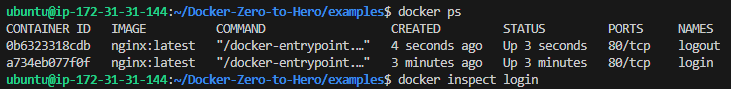
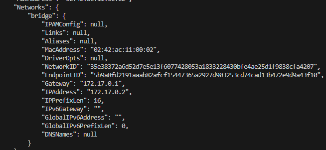
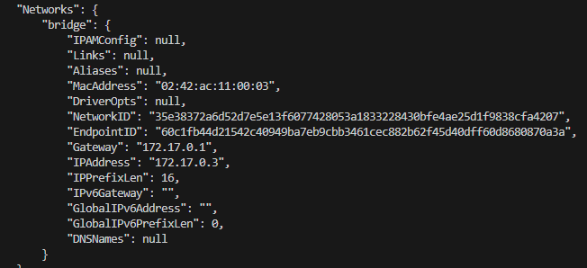

## Installation Process for Docker

https://github.com/iam-veeramalla/Docker-Zero-to-Hero?tab=readme-ov-file#install-docker

## Docker Networking Example:

### Created two containers in a single host, i.e. login and logout

### Now once I do 'docker inspect', the IPs assigned to these are 

### Now went on to ping both containers from each other. They're accessible.

But this is a security risk if any sensitive information is stored in either of the containers.