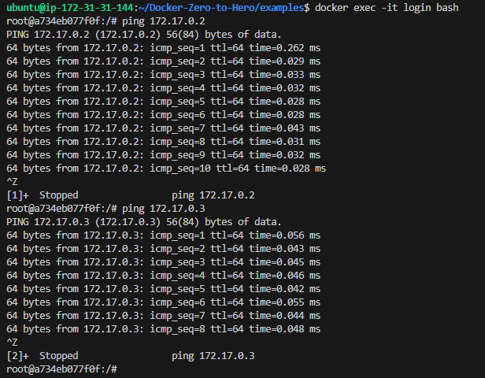
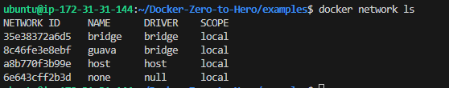

## Installation Process for Docker

https://github.com/iam-veeramalla/Docker-Zero-to-Hero?tab=readme-ov-file#install-docker

## Docker Networking Example:

### Created two containers in a single host, i.e. login and logout

### Now once I do 'docker inspect', the IPs assigned to these are 

### Now went on to ping both containers from each other. They're accessible.

But this is a security risk if any sensitive information is stored in either of the containers.

### Let's imagine a 'Finance' container which has to be isolated from other containers

### Created a separate network first - default one will be bridge network

### Created a new container called 'finance' which need to be isolated

### it will come up with different subnet of network + different network as we've set it

### So now when I try to ping it from login or logout container, it won't be successful

## This is the Docker networking in a secured way, summed up !!!